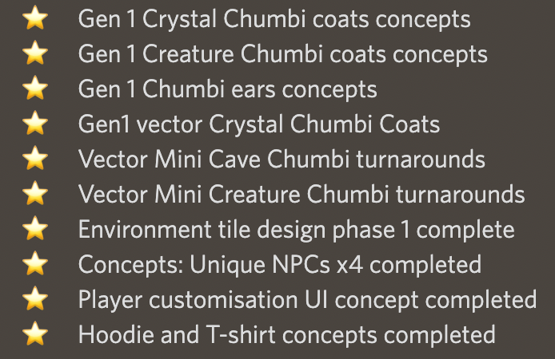

public:: true

- ## 项目概况：
	- 游戏在21年年底大力宣传后爆火，创世CHUMBI地板价很长时间在1E以上。代币CHMB价格在0.1左右。当时计划22年第二季度公测。
	- 22年第二季度，官方宣布更换游戏开发公司，之前的资源都不可用。游戏公测时间延期到第四季度。
	- 22年4月，第一轮质押到期，为缓解抛压，发起代币抽盲盒活动，只允许曾质押1K代币以上的玩家购买，所得代币全部burn掉。
		- 每个盲盒40K代币，内含1个灯笼NFT(游戏道具，重要度未知)，另有500块土地(游戏道具)、500个蛋壳(游戏内装饰品)、100张cupon(用于线上商城，暂未上线)、10个seed NFT，随机分布于共3000个盲盒中。(盲盒至今未开)
		- 最终销售了1619个，剩下近一半的盲盒销毁了。
	- 22年5月，宣布修改私募轮的代币发放时间，从锁3个月发12个月改为锁6个月发22个月。以此缓解代币抛压。
-
- ## 运营特点：
	- **丰富的社区活动**
	  collapsed:: true
		- **内容：**
			- fanart比赛
			- bot games
			  collapsed:: true
				- 大逃杀
				- 你画我猜
				- 联盟战争
				- 猜歌
				- pokemeow
			- 人工游戏
			  collapsed:: true
				- 找chumbi(参与度一般)
				- 第一个拍宠物
		- **作用：**在没有游戏的情况下维持社区活跃度
		- **可参考性：**高。成本较低且效果是我们需要的。
		- **可能的问题：**我们社区人数远远不及他们，一些竞赛类的游戏可能玩不起来。需要想一些人少或者一个人也能玩的游戏。
	- **细致的进度拆分**
	  collapsed:: true
		- **内容：**
			- 横向上：分类细。chumbi外套的概念设计图和耳朵的概念设计图可以分成两条进展来发。(详细程度直逼linear)
			- 纵向上：时间阶段划分细。一项工作开始了算一条进展，完成了算一条进展。
			- 
		- **作用：**营造出游戏进展顺利的感觉，维持社区信心，激发社区期待。
		- **可参考性：**中。如果没有实际进展，纯粹在文字上玩花活儿，容易翻车。但有进展的情况下可以参考他们的做法，把进展做成图，做成视频，写小作文，吊社区胃口。
	- **全套的定制设计**
	  collapsed:: true
		- **内容：**
		  collapsed:: true
			- 定制emoji
			- 定制GIF表情
			- 定制角色图标
			- 定制频道头图
		- **作用：**给社区成员归属感，展现社区运营用心程度
		- **可参考性：**低。属于锦上添花，目前没有资源做这个。
	- **大胆画饼**
		- 内容：团队会在刚想出主意后，就在社区宣布会做某件事，但不承诺具体时间。比如制作chumbi动画。
		- 作用：拉高玩家的期待，发布利好消息拉高币价。
		- 可参考性：中。很多内容如果上线了才说，宣传时间是不足的，进而导致上线初期人气很低，让第一批体验的玩家感受不好而离开。而且FOMO情绪需要在内容上线之前营造。但从chumbi社区看，也有很多玩家反感这种不承诺具体时间的画饼行为。所以要注意把握画饼的度。
	- **代币销毁**
		- 内容：用盲盒回收代币。盲盒内容以游戏内特殊道具为主。这类道具只在盲盒内售卖。
		- 作用：稳定币价，体现官方对代币价格负责的态度
		- 可参考性：中。可以作为发Y币后，补偿M持有者的一种方式。出一些限定盲盒，用M购买。(盲盒里是非数值型道具还是数值型道具？)
	- **AirDrop为NFT赋能**
		- 内容：对创世NFT持有者空投代币和装饰型道具
		- 作用：稳住大户心态。在没有游戏的情况下，大户买的高价NFT和小图片没有区别。这种空投和PFP类NFT的运营思路很像。强行为NFT赋能。
		- 可参考性：中。可以作为为VIP Land赋能的一种方向。
	- **及时的信息沟通**
		- 内容：双周报公布游戏开发进展；创始人半月进行一次文字AMA；运营总监半月进行一次语音AMA；每次发布新进展都大段文字重申项目愿景，强调团队在全力开发
		- 作用：增加社区信心，在游戏多次跳票的情况下依然维持了较高的社区支持度
		- 可参考性：高。高频次和社区沟通可以帮助我们获得社区的信任。
-
-
-
- 活动类型
	- giveaways(NFT)
	- 代币burning
	- KOL合作/项目合作
	- NFT breeding
	- NFT sale
	- mini game(用代币)
	- NFT交易
	- 线上商店
	- 卖地
	- 烧掉解锁的代币换NFT-最终卖出了1619个
		- 3000个宝箱，每个40000CHMB，会全部烧掉
		- 只有参与质押且质押超过1000CHMB的人才能参与
- 5月初，承认受冒充kucoin的团队诈骗，但损失不大
- 双周报
-
- 把游戏设定拆得非常细，分点罗列显得进度很快
- 把换装UI当个大事来宣布(预告、视频)-毁誉参半(夸的可能实在是下不了船了)
- 半月报感觉是把linear事项直接列出来了，非常非常细，包括启动了某项工作(但没完成)
- 在Facebook和ins上开展GLEAM活动，送了5只rare级NFT。然后借此大谈项目如何在熊市坚持做事的(很重要，稳定社区军心)
- 地图一角，单起一条。草图和上色图都发出来，显得内容很多。问个互动小问题。
- 和Rosen合作，质押三月，100%固定收益；转盘抽奖；质押一月换抽奖机会(共5000刀奖金)；存$ROSN赚$CHMB
- Discord游戏：在照片中找chumbi、第一个拍宠物照片得白名单和discord积分(要求在服务器中发言50句以上)