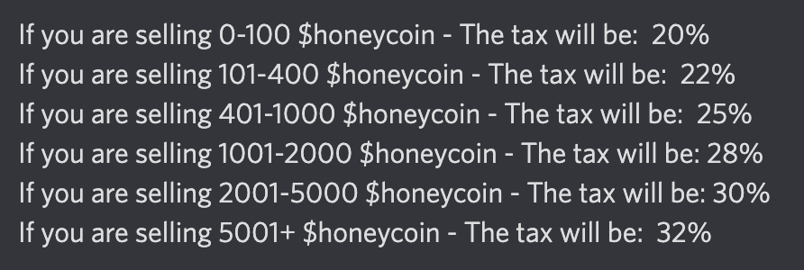

- #web3
- 
Golden Brothers

	- 
	- 
Basic Info

		- 🌐 [Website](https://goldenbros.netmarble.com/)
		- 🐦 [Twitter](https://twitter.com/GoldenBrosNM/) Followers: **38.4k**
		- 🔷 [Discord](https://discord.gg/GoldenBros) Members: **unknown**
		- 📅 live date: [[Apr 28th, 2022]]
		- ⛓️Chain: **BSC**
		- 🪙Token: **GBC**(未发售)  eGBC(内测币，兑换率未知)
		- 📈Current Price: **N/A** (白皮书上计划是1GBC=1美元)
	- 
Finance Info

		- 🎟️ Ticket: NFT皮肤(游戏免费玩，但买了皮肤才能赚eGBC)
		- 💸 Ticket Price: **299刀**一个盲盒，内含一套皮肤
		- ⏳ Payback period: **3天**(理论值)
			- ==回本周期计算方式：==
			  内测期间，装备了NFT皮肤每局获胜可以得约13个eGBC，一天最多只能打十局有代币奖励的比赛(无代币奖励的比赛无限打)。所以每天最多可以拿到130个eGBC。如果一个eGBC可以兑换一个GBC，且GBC按白皮书所承诺的以1美元的价格上交易所，则299÷130=2.3天即可回本。
			  
			  ==但目前有三个变数：==
			  1. eGBC和GBC的兑换比例。1：1兑换是宣传时暗示的，至今没有正式公布兑换比例。
			  2. 开放兑换的时间。本来游戏在五月底结束内测，就该开始兑换了，但突然宣布内测延长两个月。所以现在玩家手里的eGBC无法套现。
			  3.  GBC的实际发行价格。GBC未上交易所前，没人能保证真的按1美元的价格发行。
	- 
Others

		- 📝 Notes:
			- 类似Thetan Arena的经济模型。直接送9个免费英雄，免费玩，但想赚钱就要买入场券。
			- PC/iOS/Android 三端
			- 韩国龙头手游公司netmarble和链游平台cube联合出品的游戏，与币安有合作关系。十万个盲盒十分钟内销售一空。
				- 3月以199美元的价格发售了五万个，4月以299美元的价格发售了五万个。
- 
Flower Fam

	- 
	- 
Basic Info

		- 🌐 [Website](https://oasis.flowerfam.earth/)
		- 🐦 [Twitter](https://twitter.com/FlowerFamNFT) Followers: **191.4K**
		- 🔷 [Discord](http://discord.gg/flowerfam) Members: **17467**
		- 📅 live date: [[May 22nd, 2022]]
		- ⛓️Chain: **ETH主链**
		- 🪙Token: **$honeycoin**
		- 📈Current Price: 现价：**$1.335**  发行价：**$0.13**
	- 
Finance Info

		- 🎟️ Ticket: NFT
		- 💸 Ticket Price: 初始mint价：0.069ETH 目前地板价：0.279ETH
		- ⏳ Payback period: unknown
			- ==回本周期计算方式：==
				- 门票有较强的NFT属性，从NFT价格来看，初期mint的玩家早已回本。
				  从代币产出来看，
	- 
Others

		- 📝 Notes:
			- 游戏数据一览 https://dune.com/speedbal/test
			- 代币可用于在游戏中买种子和繁衍新一代的花
			- DAU在50上下波动
			- 交易所卖币会被征收高税
				- 
			-
-