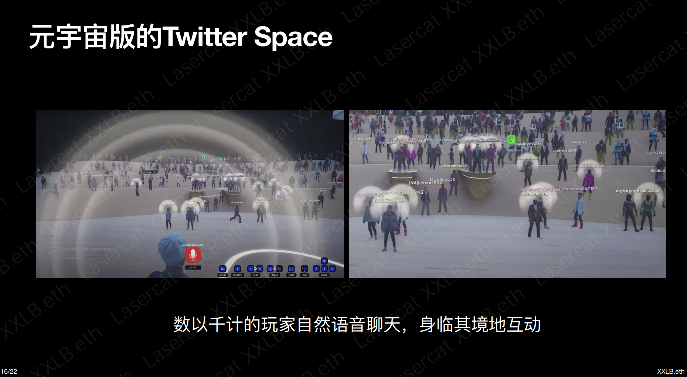

public:: true

- 前提1：MMORPG的核心属性是社交，游戏营销应该结合游戏内外社交关系的建立
- 前提2：我们的游戏足够好玩，玩家充分体验游戏流程后会愿意留下来(而不是纯靠赚钱的意念支撑)
- 原则1：从KOL入手，由上自下地吸引玩家
	- KOL承担**宣传引流**和**维护社区**的工作
- 原则2：三赢
	- 项目方：要营收、要活跃游戏数据、要讨论热度
	- KOL：要收入、要提升粉丝黏性、要吸引更多粉丝
	- 玩家：要玩得开心、要有能赚钱的希望
- **活动一：公会战**
	- 公会建立：KOL或DAO等组织可以在Discord申请成立公会，其余玩家可以在DS领取角色成为公会成员。公会成员达到20人即为成立。
	- 内测期间，游戏不对普通玩家开放。想要体验游戏，先要加入公会。
	- 维护：每个公会有单独的channel，KOL负责管理。
	- 目标：公会成员打败最终BOSS，即可获得奖金及mint盲盒白名单。最快打败BOSS的公会，可以额外获得奖金。
		- 奖金是我们根据玩家数据分配还是公会内部自行分配，待定
		- 每次打BOSS副本有人数限制；一个玩家打败BOSS后就无法再次挑战BOSS；一个公会可以多次挑战BOSS，最后奖金分配将参考成功挑战次数和最短用时
			- 这意味着，一个社区有数值很高的人打败BOSS后，他不能自己反复刷BOSS，但可以帮助社区内其他玩家成长，为其他人提供资源，让其他人也成功打败BOSS。目的是促进资源流转和团队分工。
	- 福利：限时免费武器
		- 借鉴传统游戏经过验证的有效打法：先体验，再花钱。让玩家零成本拥有，随后为了避免失去而花钱。
		- 规则
			- (一) 公会根据级别，可享24小时~72小时不等的免费体验武器时间。
			  collapsed:: true
				- Lv1 公会(20~30人)：24小时免费体验时间
				- Lv2 公会(30-50人)：48小时免费体验时间
				- Lv3 公会(50人以上)：72小时体验时间
			- (二) 活动开始时间由公会leader决定，leader可以根据成员有空的时间段选择免费体验开始的时间。
			- (三) 活动期间，所有该公会的成员可以抽取一件武器(数值随机)免费使用。该武器不可交易。
			- (四) 体验时间结束后，玩家有三种选择：
				- 选择1：买下武器，武器获得额外20%数值，且可以交易，可以继承到正式服使用。
				- 选择2：完成公会任务，延长免费体验时间
					- 游戏内任务：收集特定材料等
					- **宣传任务：带上公会的tag和游戏的tag发推、发布游戏视频、发布游戏宣传文章等**
					- 拉新任务：公会加入新人，达到更高级别，则获得对应级别的免费体验时间
				- 选择3：放弃武器，则武器失效，在背包中无法使用。72小时后武器消失。
- **活动二：盲盒预售**
  collapsed:: true
	- 盲盒1：正式服武器盲盒
		- 数量：共5K把，分批限量，阶梯定价。官方此后不再发售任何武器，后续所有武器都靠游戏内生产。
			- 前1K把：0.1 ETH
			- 1K-3K：0.25 ETH
			- 3K-5K：0.5 ETH
		- 盲盒收入的一部分会进入正式服的BOSS战的奖池
		- 公会战成功击败BOSS的队伍可以优先购买
	- 盲盒2：装备盲盒
		- 内含1~6件装备，共10K个。
		- 价格待定
		- 主要作为活动奖品
	- 盲盒3：VIP LAND及皮肤盲盒
		- 拥有VIP LAND的玩家，可以把所有内测服数据继承到正式服。
- **活动三：DS有奖答题(代替AMA)**
  collapsed:: true
	- 宣传期间，每周在DS举办3次答题比赛。每次30题。积分排名前10的玩家可以获得装备盲盒、Y token、白名单等奖励。
	- 题目内容由[50%的百科知识]和[50%的游戏相关信息]组成。
	- 这个活动也可以在合作社区内进行，题库调整为[30%的百科知识]+[30%的对方社区信息]+[40%的游戏信息]
-
-
- 一个项目有许多可以挖掘的点
  collapsed:: true
	- 经济模型分析的素材
	- 解释某种理论的素材
	- 白名单
- 节点倒推(AAARR模型)
- 结合游戏特点(UCG、占地)
- 明确人群是玩家还是crypto用户
- 明确每个活动的主目标(一个活动聚焦一个主目标)
- 和KOL的破冰点是什么？
- 先对大方向，细节先不急
-
- Acquisition
	- 目标：
		- 盲盒预售时推特人数：50K+
		- 盲盒预售时Discord人数：10K+
	- 路径：
		- 与KOL、DAO、NFT项目、游戏公会等社区合作，由合作社区带流量到我们的社区
		- 针对散户的宣传营销活动
		- 原有meland用户引流
	- 动作：
		- **社区合作**
			- 概述：以白皮书和游戏演示视频为基础，准备能让KOL自身获得经济利益的合作方案。他们帮我们在他们的社区内进行游戏宣传，并建立游戏内公会，号召社区成员进入游戏。
			- 预期目标：
				- 接触100家，与20家以上达成合作。
				- 推特粉丝增长：20K+
				- Discord粉丝增长：5K+
			- 目的：
				- 在我们运营资源有限的情况下，以社区为杠杆，放大营销动作的效果，尽量提高游戏的知名度
				- 让社区为我们背书，提高用户对我们的信任度
		- **内测前宣传任务马拉松(针对散户)**
			- 概述：类似“奥德赛”，在银河发布一系列如关注推特、加入DS、制作MEME等宣传任务，由易到难，每一步都奖励纪念NFT，最终奖励为内测资格、NFT和U金。
			- 预期目标：
				- 总参与人数：5K+
				- 完成最终任务人数：500+
				- 推特粉丝增长：10K+
				- DS粉丝增长：1K+
			- 目的：
				- 尽量提升推特粉丝数等最直观的游戏人气数据
				  collapsed:: true
					- 是否鼓励用户用僵尸号关注推特：
						- 结论：鼓励(或者说不有意限制)
						- 原因：僵尸号多的特点是粉丝多但互动少。目前，推特粉丝数是判断项目人气的第一眼指标，是绝大多数游戏研报都会考虑的数据，非常重要。而互动数据相对不直观，不那么好统计，对项目形象的影响较小。且目前大部分链游项目单条推特平均互动量也就30左右，我们互动稍微低一点也不会太扎眼。
				- 吸引合作社区未覆盖的web3用户关注游戏
				- 吸引银河平台自身的流量关注游戏
		- **Steam装备空投**
			- 思路：借鉴[P12的活动](https://www.theblockbeats.info/news/31119)，连接用户链上链下的游戏行为，体现游戏link的特性。用户可以零成本领NFT，搭配邀请激励，利于传播。实现了一次游戏在steam传统玩家中的被动宣传。
			- 概述：借助project galaxy平台，玩家绑定Steam账号，根据Steam已玩游戏的种类和时间，领取不同等级不同种类的一件装备。该装备在内测中激活方可使用和交易。邀请其他人参与这个活动可以获得其他激励。
			- 预期目标：
				- 领取装备总人数：20k+(参考：P12空投参与人数一周内达到了500K)
				- 推特粉丝增长：20K+
				- Discord粉丝增长：2K+
			- 目的：
				- 提高游戏在web3的知名度和讨论度，增加粉丝数。
				- 为用户空投一件装备，如果他们不参与内测，就无法激活装备，就亏了。以此吸引他们参与获得内测资格的活动。
				- 在Steam玩家中进行一次被动宣传，以此向web3用户讲故事。
				  collapsed:: true
					- 目前，真正吸引web2玩家阻力很大，许多传统玩家对NFT非常抗拒。但我们可以向web3用户讲“连接web2和web3世界”的故事。我们在web2领域的任何动静，都可以用来巩固这个故事。
					- 要打开web2市场，从传统端游玩家入手不太可行，但可以等移动端上线后，从轻度玩家入手。他们对游戏没有那么大的信仰，更容易接受各种简单上手的新鲜事物。
		- **特殊NFT持有者空投**
			- 思路：实践连接共建的理念，主动为部分强势NFT赋能，展现我们赋能的能力，吸引小项目主动来合作。同时向所有人讲我们“连接共建”的故事。
			- 概述：
		- **Melander搬家计划**
			- 思路：激活原有MELD和土地NFT持有者；让原有meland玩家以较小成本迁移到新游戏。
			- 概述：
		- **画饼宣传**
			- 概述：白皮书或medium文章讲述未来构想的案例，先把故事讲出去，预期拉起来，再在后面的版本中慢慢实现。
			- 可画的饼：
				- **元宇宙世界观打通：**接入loot，loot持有者相当于在游戏中持有配方，收集材料后可以直接打造出一套loot上描述的装备。(甚至可以允许玩家自己设计装备的样子)
				- **元宇宙集会：**接入语音功能后成为元宇宙版Twitter space(顺便蹭猴子地热度)
					- 
				-
			-
		- 整活儿空投(慎)
			- 思路：注意力经济，蹭震惊全网的大新闻的热度，引起自发讨论。但尺度把握不好容易引起反感。
			- 目的：极大提高项目关注度。
			- 可选内容：
				- Luna受害者空投
		-
		-
			-
- Activation
	- 参与白名单获取活动人数：10K+
	- 内测资格获取人数：5K+
	- 动作：
		- **quest3 合作活动**
			- 概述：quest3发布任务，转发推特、加入discord、参与discord答题后获得内测资格
			- 目的：
				- quest3目前正在推广期，借用quest3近期的声势为我们宣传
				- 通过用户的宣传行为提高影响力
		- **discord有奖答题活动**
			- 概述：每周两次，在discord内进行答题比赛，获胜者奖励内测资格
			- 目的：
				- 提高未能进入游戏的用户对游戏的期待
				- 提高未能进入游戏的用户对游戏的了解程度
- Retention
	- NFT白名单人数：5K+
	- 内测参与人数：1K+
	- 动作：
		- 公会对抗
			- 概述：每个KOL社区成立公会，公会间相互竞争。奖品包含经济利益奖励、荣誉性奖励和NFT白名单。
			- 活动：
			  collapsed:: true
				- 土地争霸赛
					- 在三天的活动时间里，在某个特殊区域，占地最多的公会胜出。
				- 杀怪锦标赛
					- 在最长半天的活动时间里，击杀指定怪最多的公会胜出。
				- 寻宝活动
					- 在活动开启后，最先解开官方的谜题，找到地图中藏匿的官方某个NPC的公会获胜。
			- 目的：
				- 让合作社区获得经济收益，同时提高社区内部凝聚力
				- 提高用户的游戏参与度，增加用户留存率
				- 增加游戏趣味性，提升用户对游戏的信心，促进用户到玩家的转化
		- 武器限时免费体验
			- 概述：每个公会根据规模大小，有24小时至72小时不等的免费武器体验时间。可以通过完成游戏内任务或游戏外宣传任务延长武器体验时间。也可以在体验结束后72小时内买下武器，永久拥有。
			- 目的：
				- 降低用户一开始进入游戏体验的门槛
				- 借鉴传统游戏经过验证的有效打法：先体验，再花钱。让玩家零成本拥有，随后为了避免失去而花钱
		- 社区专属任务(UGC活动)
			- 概述：引导合作社区的leaders运用UGC活动系统，发布只有社区内部人员能参与的挑战任务，奖励由官方提供。
			- 目的：
				- 为合作社区的成员提供福利，吸引他们进入游戏
				- 促进用户对UGC活动系统的了解
		- 商城U金池
			- 概述：内测期间，在商城建某些装备和U的交易对。玩家一旦合成该装备，可以直接换U。
			- 目的：
				- 以直接的利益吸引打金用户进入游戏
				- 促进用户对商城和AMM的了解
- Revenue
	- 装备盲盒第一批：500个(转化率：10%)
	- 后续盲盒：待定
- Referral
	- 内测期间，完成特定悬赏任务，可获得邀请码。
	- 邀请码最多储存两个，用掉之后才能继续获得。
	- 成功邀请玩家进入游戏可以延长武器免费体验时间。
	- 受邀者购买NFT的利润会分利给邀请者。