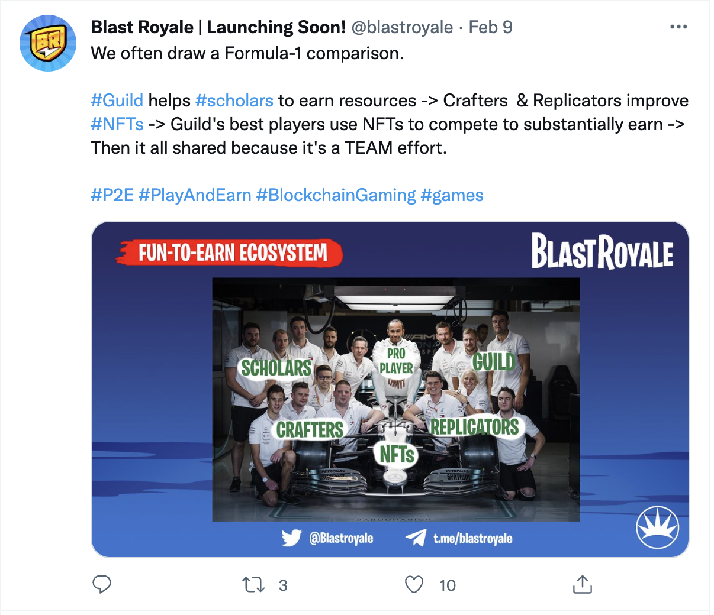

- 总结：
	- 运营阶段
		- **(一) 21年11月至22年3月初 冷启动**
			- 发布内容主要为gm、gn，白皮书更新预告，白皮书更新内容，项目进展，成员曝光，互动
			- **评价：**这一阶段一系列动作的效果并不理想，所有推特都只有一两个点赞，基本无评论。2月25日举办了线下粉丝见面会，但推特无后续活动图，推测无人参与。
		- **(二) 3月初至4月中旬 借助KOL加速积累**
			- 开始与KOL及其他项目合作，粉丝开始翻倍增长。3月8日找了两位粉丝加起来20万的KOL宣传，DS粉丝一夜之间翻了5倍，达到近2K。
			- 宣布让machinations审计了经济模型，并举办了联合AMA。
			- 一个月内进行了4次AMA，并开始每周粗略地公布游戏开发进展。
			- 3月24日，创始人参加了GDC2022。(创始人本身有深厚的传统游戏开发背景，参与过《古墓丽影》《纪念碑谷》等游戏开发)
			- 3月29日，推特粉丝数到1000人。
			- **评价：**这一阶段借助KOL，数据开始有了起色。虽然粉丝总数上涨，但活跃粉丝增长不大。大多数推特的互动量仍然是个位数。KOL的效应更像是一次性的，大量粉丝随KOL涌来，又快速散去。
		- (三) 4月中旬至5月5日 借助VC起飞，密集宣传维持优势
			- 4月13日，官宣拿到了animoca和mechanism领投的500万U种子轮投资。从此数据上了一个台阶。推特互动量稳定在两位数以上。
			- 开始和DAO及公会建立合作关系，DAO产出了一些教程及宣传文章。
			- 同期开始大量买宣传通稿，中英文都能搜到许多游戏宣传文章。甚至包括网易号也发了游戏和某DAO合作的新闻。
			- 转发抽奖活动宣传5月的内测。
			- 评价：这一阶段借由顶级VC的背景，开始和组织建立合作关系，获取宣传资源。同时也自己投放了许多宣传文章。保持住了融资新闻带来的热度。
		- 5月5日至今 内测期高强度宣传
		-
-
- 在4月中旬买了大量的宣传文章
- 2021年11月16日，开设推特
- 2021年12月1日，官网上线，同时发布出版白皮书 (含第一版代币解锁计划)
- 12月7日和23日，发了两条聊天推，无人响应
- 12月24日，发布文章，简要描述了blast royale的愿景，无人响应
- 12月30日，修改了白皮书，增加了武器复制的设置(逻辑同axie繁衍)
- 1月5日，白皮书增加了“角色”和“区块链技术”两页
- 1月7日，过去两周在和VC聊，公布了第二版代币解锁计划 https://blastroyale.medium.com/token-unlock-schedule-update-c544cfc035f8
- 1月12日，白皮书增加“武器经验”页
- 1月14日，发布谜题，解谜后可以得到解压密码，打开后是一张游戏的宣传图 #可借鉴
- 1月16日，公布了项目请的三个顾问
- 中途发布早安推，也会蹭蹭特斯拉或狗狗币的热点，并不断新增白皮书内容(功能逐步公布)
- 1月21日，发布roadmap
- 1月22日，发布了一张团队在伦敦和其他项目方聚会的照片
- 1月25日，白皮书新增“经济模型”页
- 1月25日，发布了一篇创始人谈链游未来的文章，互动量为6
- 1月29日，发布了第一篇进度介绍，内含一张游戏地图和一段玩家降落在某个地点的视频
- 2月2日，预告了2月25日会在伦敦举办meetup
- 2月5日，公开招聘一名社区运营经理(未承诺工资)
- 2月8日，转发polygon的推(原推与游戏无关，BR纯蹭热度) #可借鉴
- 2月9日，用F1的团队来解释公会和游戏中的各种职业如何合作获利
	- 
- 日常哈拉，让玩家给游戏功能取名，应者寥寥
- 2月22日，转发YGG的subDAO会在8月IEO的推，免费宣传
- 2月25日，发布meetup信息
- 2月25日，转发了玩家画的游戏人物图
- 2月26日，发布了团队开会图
- 2月28日，发布了详细的roadmap，被一个VC转发，互动数首次上50
- 3月1日，公开招聘美术和开发
- 3月3日，发布Discord前500名成员有OG role的活动 #可借鉴
- 3月4日，预告3月10日推特SPACE AMA
- 3月7日，discord成员420
- 3月8日，DS终于有了500人，扩充OG名额到1500
- 找了两个加起来20万粉的KOL，一夜间DS粉丝数翻了近五倍
	- https://twitter.com/blastroyale/status/1501108349567447041?s=20&t=ptKEq3J2heuNdcT3My6adQ
- 3月9日，4万粉KOL发布BR角色图，互动量<20
- 3月10日，场景路透
- 3月11日，线上开会图
- 每周更新一次这周在做什么(不公布具体进度)
- 3月15日，预告3月17日第二次AMA
- 3月16日，宣布和machinations合作，验证经济模型
- 3月17日，转发了KOL做的游戏宣传视频
- 3月22日，推特粉丝达900人
- 3月23日，宣布去掉曾经的bonding curve，直接用交易所交易token
- 3月24日，创始人参加GDC22
- 3月28日，预告下周四开始内测
- 3月29日，推特粉丝达1000人
- 4月1日，在3K粉丝的社群进行AMA
- 4月4日，预告6号会和machinations联合AMA
- 4月5日，内测活动
	- 为期三周，500个名额，社区活跃成员有资格参与，只能体验10人人头赛，奖品为OG ROLE、白名单和BLST
- 开始大量转KOL的宣传，多为1K粉以下的小KOL。时不时转发大机构的推，营造和大机构关系很好的感觉。
- 发布了两三次游戏内部测试视频
- 4月13日，拿到了animoca和mechanism领投的500万U种子轮投资。(从此数据上了一个台阶)
- 4月14日，转赞评活动，奖励是内测资格，参与量两百多
- 4月18日，和28K粉丝的RPD DAO合作AMA
- 5月4日，推特5K粉
- 5月5日，内测正式开始
- 5月11日，宣布和DWeb3 Capital 合作，并称DWeb3提供了许多游戏营销的建议
- 5月11日，宣布每周会放出50个内测资格
- 5月12日，开始推特游戏录屏发布比赛，参与者二三十人
- 5月12日，YGGindia宣布合作，并投入5万刀
- 5月13日，和C2 Ventures 达成合作
- 5月14日，发布工作照
- 随后一周频繁转发玩家作品
- 5月16日，和mintable.app合作
- 5月17日，直播打了一局比赛，并把录屏发到了推特
- 5月19日，直播奖金赛-第一名有200BLST，参与奖为经验值
- 5月24日，和merit circle举办绘画比赛，奖品为20个内测名额，参与人数30左右
- 5月25日，反馈有礼，最高奖100BLST，参与人数最高46人
- 5月25日，官宣和游戏平台rainmakergaming合作
- 日常互动送几个内测名额
- 5月27日，宣布延长内测到六月底，每周会再开放100个内测名额
- 五月一共官宣了8个合作伙伴
- 五月一共放出了789个内测名额
- 6月6日，开始发放NFT白名单
- 6月7日，和avocadoDAO合作开展锦标赛，奖金1200刀
- 6月7日，有一百万粉的推特大V[@TheCryptoLark](https://twitter.com/TheCryptoLark)发布了游戏白名单活动的信息
-